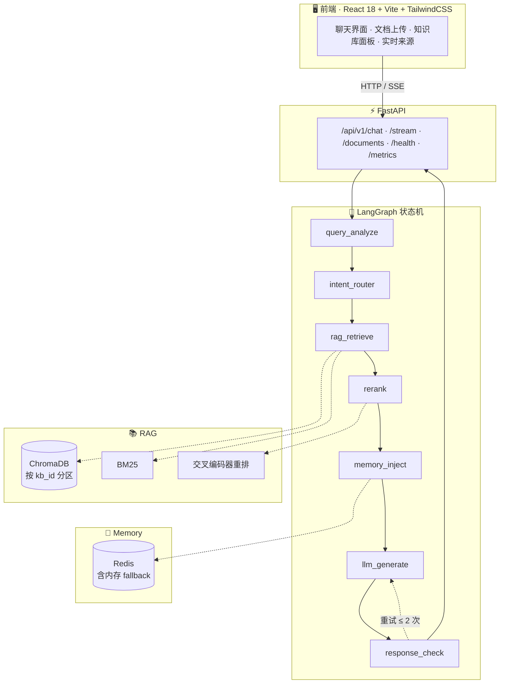

<div align="center">

# AI 科研助手

**上传你的文献，得到一个只依据它们作答、并且每条结论都标注出处的问答助手。**

基于 LangGraph 编排的多知识库 RAG 系统 —— 领域由你的语料决定，不预设学科。

[](backend/)
[](https://fastapi.tiangolo.com)
[](https://github.com/langchain-ai/langgraph)
[](https://www.trychroma.com/)
[](frontend/)
[](LICENSE)

</div>

---

<!--
  建议在 docs/screenshots/ 放几张截图，然后解开下面的注释 —— README 首屏有一张图，
  仓库点开率和一段纯文字完全不是一个量级。
  <div align="center"></div>
-->

## 它解决什么问题

通用大模型回答专业问题时，你无法判断这句话是来自你的资料还是模型自己编的。这个项目的出发点很朴素：

**把模型的发挥空间严格限制在你上传的文献范围内，并且让每一句回答都可追溯。**

具体体现在三个地方：

- **限定式作答** —— Prompt 明确要求"只依据给定上下文"，上下文不足时如实回答"知识库中没有相关依据"，
  而不是补一段听起来合理的推测。
- **引用溯源** —— 答案携带来源列表，含文件名**和所属知识库**，去重后按相关度排序。
  流式接口在检索完成的瞬间就先把来源推给前端，答案还在生成时你已经能看到它依据了谁。
- **多知识库隔离** —— 提问时勾选检索范围。只勾「深度学习文献」时，其他库的文档不会被引用，
  也不会出现在引用列表里。传入不存在的 id 不会报错，而是检索不到内容 —— **不会悄悄放宽成全库检索**。

> 一条重要边界：这是**文献问答**助手，不是写作代笔。`academic_writing` 只做润色、翻译、
> 摘要凝练与审稿回复，且要求保留原文事实与限定条件。

---

## 目录

- [四种研究能力](#四种研究能力)
- [快速开始](#快速开始)
- [架构](#架构)
- [工作流细节](#工作流细节)
- [知识库](#知识库)
- [配置](#配置)
- [嵌入与重排](#嵌入与重排)
- [API 参考](#api-参考)
- [会话隔离](#会话隔离)
- [项目结构](#项目结构)
- [技术栈](#技术栈)
- [开发工作流](#开发工作流)
- [部署](#部署)
- [已知限制](#已知限制)
- [常见问题](#常见问题)
- [路线图](#路线图)
- [贡献](#贡献)
- [许可证](#许可证)

---

## 四种研究能力

意图由提问内容自动识别，不需要用户手动选择：

| 意图 | 能力 | 回答结构 | 触发特征 | 检索宽度 |
|:---|:---|:---|:---|:---|
| `concept_qa` | 概念与原理问答（默认） | 结论 → 为什么 / 如何起作用 → 标注依据 | 是什么、为什么、机制、原理 | 10 段 |
| `literature_review` | 文献综述与研究现状 | 脉络 / 路线 / 共识与分歧 / 未决问题 / 覆盖缺口 | 研究现状、进展、综述 | 24 段 |
| `method_compare` | 方法对比与选型 | 对比表格 → 逐项依据 → 有条件的选型建议 | 对比、区别、优缺点、如何选择 | 16 段 |
| `academic_writing` | 学术写作与润色 | 先给修改稿 → 再列修改点与理由 | 润色、翻译、摘要、审稿回复 | 8 段 |

检索宽度不是全局固定值，而是跟着意图走 —— 综述需要覆盖度所以放宽到 24 段，写作主要依据你粘贴的
草稿所以只取 8 段避免稀释 Prompt。这四个数字定义在
[`intent_router.py`](backend/app/agent/nodes/intent_router.py) 的 `INTENT_CONFIG` 里，
是全项目唯一的意图配置源，路由和检索都从这一张表读。

命中不了任何特征的普通提问会落到 `concept_qa`，不会被强行塞进某种固定格式。

---

## 快速开始

本地开发需要三样东西：**一个 Python 3.11 环境装好依赖、一个 LLM API Key、一个本地 Embedding 模型。**
建议先把模型下载开着，再往下看 —— 那是唯一没法用命令瞬间搞定的一步。

> ⚠️ **不要用已装过 LangGraph 的旧环境凑合。** 本仓库锁的是 `langgraph==0.0.51`
> （`set_entry_point` 等 0.0.x API），LangGraph 1.x 里这套 API 已被移除。
> 用之前务必核对版本，否则启动第一行就报
> `AttributeError: 'StateGraph' object has no attribute 'set_entry_point'`。

### 1. 安装依赖

```bash
conda create -n rd-agent python=3.11 -y && conda activate rd-agent
cd backend && pip install -r requirements-lite.txt && pip install pytest
cd ../frontend && npm install
```

> `requirements-lite.txt` 约 1 GB；`requirements.txt` 会连带拉入 CUDA 版 torch（约 2.5 GB），
> 而本服务的嵌入推理始终跑在 CPU 上，没有需求就别用。

装完**核对版本**，这一步能提前拦下绝大多数环境问题：

```bash
pip show langgraph langchain chromadb | grep -E "^(Name|Version)"
# 期望：langgraph 0.0.51 / langchain 0.2.5 / chromadb 0.5.3
```

只要有一个对不上，说明装到了别的解释器上。用 `pip show` 而不是 `python -c "import ..."`，
因为 langgraph 0.0.51 不暴露 `__version__`，导入检查会给假的安心感。

### 2. 配置 `.env`

```bash
cp backend/.env.example backend/.env
```

最少改三行：

```ini
LLM_API_KEY=sk-你的key
LLM_MODEL=deepseek-chat
EMBEDDING_MODEL=D:/models/bge-m3        # 本地 bge-m3 目录，见下一条
```

> ⚠️ **行尾 `#` 注释前必须有空格。** `python-dotenv` 只剥离前面有空白的行内注释，
> 写成 `LLM_MODEL=deepseek-chat#自选` 的话，值会是 `deepseek-chat#自选`，LLM 调用返回 400；
> 粘在路径后面则更隐蔽 —— 嵌入器静默降级，语义检索直接失效。

### 3. 下载 Embedding 模型

```bash
huggingface-cli download BAAI/bge-m3 --local-dir D:/models/bge-m3
# 可选：交叉编码器重排
huggingface-cli download BAAI/bge-reranker-base --include "onnx/*" --local-dir D:/models/bge-reranker-base
```

> 模型必须放在**纯英文路径**下。onnxruntime 无法从含中文的路径加载大型自包含图。

### 4. 启动

```bash
# 终端 1 —— 后端
cd backend
python -m uvicorn main:app --host 127.0.0.1 --port 8002 #如果返回端口占用，可以自行修改端口

# 终端 2 —— 前端
cd frontend
npm run dev
```

打开 **http://localhost:5173**。

> 🔴 **后端端口必须是 `8002`。** [`vite.config.ts`](frontend/vite.config.ts) 的 dev proxy 目标写死了
> `http://localhost:8002`。跑在常见的 8000 上会导致前端所有请求失败，而且报错是"网络错误"
> 而不是 4xx，很容易往错误方向排查。Docker 部署走容器网络，那边是 8000。

**完整 VS Code 流程**（解释器选择、已安装组件清单、断点位置、故障排查）见
📄 [`VSCODE_SETUP.md`](VSCODE_SETUP.md)。

验证：

```bash
curl http://localhost:8002/health
curl http://localhost:8002/api/v1/documents/stats   # 非 0 表示示例语料已入库
```

---

## 架构



一层数据流讲清楚：**请求 → `AgentState` → 七个节点依次改写这个状态 → 最后一个节点产出 `final_response`。**
节点之间不互相调用，全部通过状态字典传递 —— 这是 LangGraph 的核心约定，也是它能做条件重试的原因。

---

## 工作流细节

```
用户问题
    │
    ▼
query_analyze      ← 抽取关键词（中文分词出 bigram）、检测意图
    │
    ▼
intent_router      ← 从 INTENT_CONFIG 取检索宽度，写入 state
    │
    ▼
rag_retrieve       ← BM25 + 向量混合检索，RRF 融合
    │
    ▼
rerank             ← 交叉编码器精排（未配置模型时保持融合顺序）
    │
    ▼
memory_inject      ← 注入 Window Memory + Summary Memory
    │
    ▼
llm_generate       ← 按意图派发给四个专用 Agent 之一
    │
    ▼
response_check     ← 质量校验（长度 / 拒识 / 对比结构）
    │
   ┌┴────────┐
   │   重试   │ ← 最多 MAX_RETRY_ITERATIONS 次
   └─────────┘
```

### 两个值得单独说的设计

**① 检索失败时有两级降级，语义不同**

混合检索会拼两个过滤条件：意图级 hint（如文档类型）和用户指定的知识库范围。前者是检索建议，
匹配不到可以丢；后者是用户指令，悄悄放宽就变成了"用你明确排除的知识库回答你"。

```python
# rag_retrieve.py
kb_filter    = build_where_filter(None, kb_ids)                    # 用户范围，不可丢弃
where_filter = build_where_filter(config["collection_filter"], kb_ids)
docs = retriever.hybrid_search(..., where_filter=where_filter, fallback_filter=kb_filter)
```

**② 诚实降级**

嵌入器和重排器各自的多个后端都会按顺序尝试，任一失败就降级，但**启动日志会写明真正生效的模式**：

```
embedding_mode  mode=offline_hash  note=Semantic search is DISABLED...   ← 语义检索不可用
reranker_ready  mode=onnx         active=True                            ← 精排生效
reranker_ready  mode=score_sort   active=False                           ← 精排实际是 no-op
```

⚠️ `score_sort` 的含义要明确：此时重排节点按 `score` 再排一次，而 `score` 就是 RRF 的输出，
这一步等价于没做。这不是 bug，但**不能对外说"用了交叉编码器精排"** —— 日志和
`BGEReranker.mode` 会如实反映。

---

## 知识库

每个知识库是一个命名独立的领域集合：上传时指定目标库，提问时勾选检索范围，
回答下方标出引用了哪些文件、以及它们分别来自哪个库。

### 三种建立方式

<details>
<summary><b>方式一 · 前端（推荐）</b></summary>

在左侧「知识库」面板：

1. 点「新建知识库」，输入领域名（如「深度学习文献」「临床指南」）。名称唯一，重名会被拒绝。
2. 在「添加文献」里选好目标库再上传文件。支持 `.md` `.txt` `.pdf` `.docx` `.html` `.wiki` `.kt` `.java`。
3. 用每行前的勾选框决定检索范围。
4. 回答下方列出 `attention_notes.md · 深度学习文献` 这样带归属的引用。

</details>

<details>
<summary><b>方式二 · API</b></summary>

```bash
# 建库
curl -X POST http://localhost:8002/api/v1/documents/knowledge-bases \
  -H "Content-Type: application/json" \
  -d '{"name": "深度学习文献"}'

# 上传到该库（knowledge_base_id 取自上面的响应）
curl -X POST http://localhost:8002/api/v1/documents/upload \
  -F "knowledge_base_id=kb_xxxxxxxxxx" \
  -F "file=@docs/transformer_attention.md"

# 只在这个库里提问
curl -X POST http://localhost:8002/api/v1/chat \
  -H "Content-Type: application/json" \
  -d '{"query": "自注意力机制解决了什么问题", "knowledge_base_ids": ["kb_xxxxxxxxxx"]}'
```

`knowledge_base_ids` 省略或传空数组表示检索全部知识库。

</details>

<details>
<summary><b>方式三 · 启动时自动导入（默认开启）</b></summary>

服务启动时会扫描 `docs/` 目录**（只扫根层、不递归）**，把所有支持的文件索引进默认知识库，
让全新克隆的仓库开箱即可问答，而不是检索到 0 条文档。

```bash
python backend/scripts/seed_docs.py                                   # 导入内置示例语料
python backend/scripts/seed_docs.py /path/to/docs --kb 深度学习文献    # 导入指定库
```

分片 ID 是含所属知识库的内容哈希，重复执行只跳过已存在的分片，不会重复调用嵌入模型。
同一个文件上传到两个库会被各自索引 —— 这是有意的：同名文件在不同领域里含义不同。

用 `AUTO_SEED_DOCS=false` 关闭。

> 因此**非语料的 Markdown（如架构笔记）不要放在 `docs/` 根层**，否则会被灌进知识库。

</details>

### 附带的示例语料

| 文件 | 领域 |
|---|---|
| `transformer_attention.md` | 深度学习 |
| `crispr_gene_editing.md` | 生物医学 |
| `monetary_policy_transmission.md` | 经济学 |
| `compose_guide.md` / `crash_analysis.md` / `database_interview.md` | 软件工程 |

它们只是**演示数据**，不代表助手的能力边界 —— 换成你自己的文献即可，助手不预设学科。

---

## 配置

所有配置通过 `.env` 或环境变量注入，由 [`config.py`](backend/app/core/config.py) 统一管理。

| 变量 | 默认值 | 说明 |
|:---|:---|:---|
| `LLM_API_KEY` | `sk-placeholder` | **必填**，DeepSeek / OpenAI API Key |
| `LLM_API_BASE` | `https://api.deepseek.com/v1` | OpenAI 兼容端点 |
| `LLM_MODEL` | `deepseek-chat` | 模型名称 |
| `EMBEDDING_MODE` | `local` | `onnx` / `local` / `openai` / `offline` |
| `EMBEDDING_MODEL` | `BAAI/bge-m3` | HF 仓库名或本地模型目录 |
| `USE_RERANKER` | `true` | 是否启用交叉编码器重排 |
| `RERANKER_ONNX_PATH` | 空 | 本地 ONNX 重排目录；填了即启用精排（最省依赖的方式） |
| `RERANKER_MODEL` | `BAAI/bge-reranker-v2-m3` | FlagEmbedding / sentence-transformers 路径用的模型 |
| `RERANK_SCORE_THRESHOLD` | `0.5` | 低于此分的段落不作为引用；设 `0` 关闭过滤 |
| `TOP_K_RETRIEVE` | `10` | 检索返回数量（实际会被意图配置覆盖） |
| `TOP_K_RERANK` | `5` | 重排后保留数量 |
| `CHUNK_SIZE` / `CHUNK_OVERLAP` | `512` / `64` | 分块参数 |
| `ADMIN_API_KEY` | 空 | 设置后，知识库增删、文档上传、预览和清空要求 `X-Admin-Key` |
| `AUTO_SEED_DOCS` | `true` | 启动时索引 `docs/` 到默认知识库 |
| `SEED_DOCS_DIR` | 空 | 覆盖默认的种子目录 |
| `KB_REGISTRY_PATH` | `./data/knowledge_bases.json` | 知识库名称与描述的存储位置 |
| `REDIS_TTL` | `604800` | 会话记忆有效期（7 天） |

> 🔒 `ADMIN_API_KEY` 默认为空，此时文档管理接口（上传 / 片段预览 / **清空知识库**）不校验任何凭据。
> 默认配置是为了本地开发方便，**对外暴露前务必设置** —— 启动日志会输出 `admin_key_not_configured` 警告。
> 完整清单见 [`SECURITY.md`](SECURITY.md)。

---

## 嵌入与重排

### 嵌入模式

| `EMBEDDING_MODE` | 实现 | 依赖 | 说明 |
|:---|:---|:---|:---|
| `onnx` | BGE-M3 via onnxruntime | `onnxruntime` + `tokenizers` | **推荐**。不需 PyTorch，CPU 推理更快 |
| `local` | BGE-M3 via sentence-transformers | `sentence-transformers` + torch（数 GB） | `requirements.txt` 的默认路径 |
| `openai` | OpenAI 兼容 `/embeddings` | 网络 + `LLM_API_KEY` | 省本地资源 |
| `offline` | 离线哈希向量（384 维） | 无 | 兜底，**语义检索不可用** |

**为什么提供 `onnx` 这条路**：`sentence-transformers` 会连带安装 PyTorch，Windows 上默认拉的是
CUDA 版本（约 2.5 GB），而本服务的嵌入推理始终跑在 CPU 上。BGE-M3 的模型目录本身就带一份
ONNX 导出，且该导出**已包含稠密头**（CLS pooling + L2 归一化）—— 已验证 `sentence_embedding`
与 `token_embeddings` 的归一化 CLS 池化在 float32 精度内一致（最大误差 1.5e-08）。
`onnxruntime` 与 `tokenizers` 本来就随 chromadb 安装，因此这条路径**零新增体积**。

> 若已入库的向量维度与当前嵌入器不一致（例如从 `offline` 切到 `onnx`，384 → 1024），
> 服务会**拒绝使用该集合**并明确报错，而不是让 Chroma 抛出难以定位的底层异常。
> 恢复方式：改回原嵌入配置，或把 `CHROMA_PERSIST_DIR` 指向新目录后重新 seed。

### 重排模式

重排是**可选的精度补充**：混合检索（BM25 + 向量 + RRF）负责把候选捞全，交叉编码器再对每个候选
与问题做一次联合打分 —— 这也是双编码器做不到的事，它从不把问题和段落放在一起看。

解析顺序（[`reranker.py`](backend/app/rag/reranker.py)，前一个不可用则尝试下一个）：

| 模式 | 依赖 | 说明 |
|:---|:---|:---|
| `onnx` | `onnxruntime` + `tokenizers`（已随 chromadb 安装） | **零新增依赖、不需 PyTorch** |
| `flag` | `FlagEmbedding` + PyTorch | 官方 BGE 重排包 |
| `cross_encoder` | `sentence-transformers` + PyTorch | 通用 CrossEncoder |
| `score_sort` | 无 | 没有可用的交叉编码器，保持 RRF 融合顺序 |

**启用方式**（最省事的一条）：下载 `BAAI/bge-reranker-base` 的 `onnx/` 子目录（约 1.06 GB，
官方自带 ONNX 导出），放到**纯英文路径**后指定：

```bash
RERANKER_ONNX_PATH=D:/models/bge-reranker-base
```

`bge-reranker-v2-m3` 效果更好，但官方只提供 PyTorch 权重、没有 ONNX 导出，
需要走 FlagEmbedding 路径并额外安装 PyTorch。

> 关于阈值：重排分数不足 0.5 的段落会被移出引用列表。这个过滤**只对真实得分生效** ——
> RRF 融合分和交叉编码器得分不是一个量纲，拿 0.5 去卡前者毫无意义。
> 见 [`chat.py`](backend/app/api/chat.py) 的 `_passes_relevance_threshold`。

---

## API 参考

启动后访问 `http://localhost:8002/docs` 查看 Scalar UI。
其余文档入口：`/swagger`（Swagger UI）、`/redoc`（ReDoc）、`/metrics`（Prometheus）。

| Method | Path | 说明 |
|:---|:---|:---|
| `POST` | `/api/v1/chat` | 同步问答 |
| `POST` | `/api/v1/chat/stream` | SSE 流式问答 |
| `GET` | `/api/v1/chat/sessions` | 列出当前客户端的会话 |
| `GET` | `/api/v1/chat/session/{id}/history` | 会话历史 |
| `DELETE` | `/api/v1/chat/session/{id}` | 清除会话 |
| `GET` `POST` | `/api/v1/documents/knowledge-bases` | 列出 / 新建知识库 |
| `PATCH` `DELETE` | `/api/v1/documents/knowledge-bases/{id}` | 重命名 / 删除知识库 |
| `DELETE` | `/api/v1/documents/knowledge-bases/{id}/documents` | 清空该库内容（保留库本身） |
| `POST` | `/api/v1/documents/upload` | 上传文献到指定知识库 |
| `POST` | `/api/v1/documents/upload-text` | 直接提交文本，不经由文件 |
| `GET` | `/api/v1/documents/chunks` | 分片预览 |
| `GET` | `/api/v1/documents/stats` | 分片统计 |
| `GET` | `/health` | 健康检查 |

### 响应里的 `sources`

```json
{
  "intent": "method_compare",
  "retrieved_count": 8,
  "sources": [
    {
      "document": "transformer_attention.md",
      "knowledge_base_id": "default",
      "knowledge_base_name": "默认知识库"
    },
    {
      "document": "attention_notes.md",
      "knowledge_base_id": "kb_79f3a3f0e3",
      "knowledge_base_name": "深度学习文献"
    }
  ],
  "is_valid": true
}
```

已去重并按相关度排序。同一个文件名出现在两个库里时是两条不同的引用 —— 它们本就指向不同的内容。
流式接口的 `rerank` 进度事件也会带上 `sources`，因此前端可以在答案还在生成时就先显示来源。

---

## 会话隔离

会话按浏览器匿名身份隔离。客户端首次生成一个 UUID 并通过 `X-Client-Token` 请求头发送，
后端在首次对话时把 `session_id` 绑定到该 token：

```bash
curl -X POST http://localhost:8002/api/v1/chat \
  -H "Content-Type: application/json" \
  -H "X-Client-Token: $(uuidgen)" \
  -d '{"query": "什么是注意力机制"}' -i
```

`history` 与 `DELETE` 接口会校验归属，token 不匹配返回 `403`。不带该请求头的调用仍可创建新会话，
但无法访问任何已被绑定的会话。

---

## 项目结构

```
langgraph-ai-rd-agent/
├── backend/
│   ├── app/
│   │   ├── agent/
│   │   │   ├── graph.py                # LangGraph 状态机主图
│   │   │   ├── state.py                # AgentState TypedDict
│   │   │   ├── nodes/                  # 7 个节点实现
│   │   │   │   ├── query_analyze.py    #   关键词抽取 + 意图检测
│   │   │   │   ├── intent_router.py    #   INTENT_CONFIG —— 意图的唯一配置源
│   │   │   │   ├── rag_retrieve.py     #   混合检索（含两级降级）
│   │   │   │   ├── rerank.py           #   交叉编码器精排
│   │   │   │   ├── memory_inject.py    #   历史记忆注入
│   │   │   │   ├── llm_generate.py     #   派发到专用 Agent
│   │   │   │   └── response_check.py   #   质量校验 + should_retry
│   │   │   └── agents/                 # 4 个专用 Agent + 基类
│   │   ├── rag/
│   │   │   ├── loader.py               # MD / PDF / DOCX / 代码 加载器
│   │   │   ├── chunker.py              # 标题感知分块
│   │   │   ├── onnx_embedding.py       # ONNX BGE-M3 嵌入（无需 PyTorch）
│   │   │   ├── vectorstore.py          # ChromaDB，按 kb_id 逻辑分区
│   │   │   ├── kb_registry.py          # 知识库注册表
│   │   │   ├── retriever.py            # BM25 + 向量混合，RRF 融合
│   │   │   ├── reranker.py             # 重排（含多种后端降级）
│   │   │   ├── onnx_reranker.py        #   └─ ONNX 后端
│   │   │   └── ingest.py               # 统一导入流水线
│   │   ├── memory/
│   │   │   ├── conversation.py         # Window + Summary Memory
│   │   │   ├── session_registry.py     # 会话归属（匿名 token 绑定）
│   │   │   ├── session_meta.py         # 会话元信息
│   │   │   └── redis_store.py          # Redis（含内存 fallback）
│   │   ├── prompt/templates.py         # 限定式 Prompt 模板
│   │   ├── api/
│   │   │   ├── chat.py                 # 同步 / SSE，含引用过滤与阈值
│   │   │   ├── documents.py            # 知识库 CRUD + 上传 + 片段预览
│   │   │   └── health.py               # 健康检查
│   │   └── core/
│   │       ├── config.py               # 配置管理
│   │       ├── security.py             # Admin Key + 会话归属校验
│   │       └── logging_config.py       # structlog 日志
│   ├── scripts/
│   │   ├── export_openapi.py           # 导出 openapi.json（类型契约源）
│   │   └── seed_docs.py                # 手动把目录导入指定知识库
│   ├── tests/                          # pytest（意图路由 / RRF / 校验 / 会话隔离）
│   ├── main.py                         # FastAPI 入口 + 启动预热
│   ├── requirements.txt                # 含 torch
│   ├── requirements-lite.txt           # 精简路线，配合 EMBEDDING_MODE=onnx
│   └── Dockerfile
├── frontend/
│   ├── src/
│   │   ├── components/
│   │   │   ├── ChatInterface.tsx       # 主问答界面
│   │   │   ├── MessageBubble.tsx       # 回答气泡 + 引用来源
│   │   │   ├── ResearchModes.tsx       # 四种研究能力展示
│   │   │   ├── KnowledgeBasePanel.tsx  # 知识库新建 / 勾选 / 删除
│   │   │   ├── DocumentUpload.tsx      # 上传 + 片段预览
│   │   │   ├── Sidebar.tsx             # 品牌与侧边栏
│   │   │   └── Dialog.tsx              # 通用对话框
│   │   ├── hooks/
│   │   │   ├── useSessions.ts          # 会话列表与历史
│   │   │   ├── useKnowledgeBases.ts    # 知识库列表与检索范围
│   │   │   └── useTheme.ts             # 主题
│   │   ├── researchModes.ts            # 研究能力的单一数据源
│   │   ├── services/api.ts             # HTTP + SSE 客户端（携带匿名身份）
│   │   └── types/
│   │       ├── index.ts                # 领域类型（派生自生成文件）
│   │       └── api.generated.ts        # openapi-typescript 生成，勿手改
│   ├── nginx.conf
│   ├── Dockerfile
│   └── vite.config.ts                  # ⚠️ dev proxy 目标是 :8002
├── docs/                               # 示例语料（启动时自动索引，勿放其他 md）
├── openapi.json                        # 已提交的 API 契约
├── docker-compose.yml
├── VSCODE_SETUP.md                     # 本地开发 / 调试完整流程
├── CHANGELOG.md
└── SECURITY.md
```

---

## 技术栈

| 层 | 选型 | 版本 |
|:---|:---|:---|
| 编排 | LangGraph | `0.0.51` |
| LLM 集成 | LangChain + langchain-openai | `0.2.5` / `0.1.13` |
| Web 框架 | FastAPI + uvicorn | `0.111.0` |
| 向量库 | ChromaDB（持久化） | `0.5.3` |
| Embedding | BGE-M3（ONNX 路径） | 1024 维 |
| 稀疏检索 | rank-bm25 | `0.2.2` |
| 重排 | 交叉编码器（ONNX / Flag / ST） | 可选 |
| 记忆 | Redis（含内存 fallback） | `5.0.6` |
| 日志 / 指标 | structlog + Prometheus | — |
| 前端 | React 18 + TypeScript + Vite | — |
| 样式 | TailwindCSS | `3.4` |
| Markdown | react-markdown + syntax-highlighter | — |

> LangGraph 用的是 `set_entry_point` / `add_conditional_edges` 等 **0.0.x API**，与锁版本一致。
> 升级到 0.1+ 需要按新的 `StateGraph` API 迁移（`add_edge(START, ...)` 取代 `set_entry_point`）。

---

## 开发工作流

### 类型契约

前端接口类型**全部派生自后端 OpenAPI schema，不要手写**。后端接口有改动时执行：

```bash
python backend/scripts/export_openapi.py   # 后端代码 → openapi.json
cd frontend && npm run api:types           # openapi.json → src/types/api.generated.ts
cd frontend && npm run api:check           # 校验是否有漂移
```

`openapi.json` 与 `src/types/api.generated.ts` 都要提交。
目的是避免"后端改了字段名、前端编译通过但运行时静默 undefined"。

> ⚠️ 仓库**没有 CI 配置**，`api:check` 和 `pytest` 需要手动跑。

### 测试

```bash
cd backend && pytest -v        # 需额外 pip install pytest
```

覆盖：意图路由、混合检索 RRF 合并、响应校验、会话归属隔离、admin key 校验。

### 调试

`.vscode/launch.json` 已配好前后端联合启动。断点位置推荐顺序见
[`VSCODE_SETUP.md`](VSCODE_SETUP.md#阶段-9--打断点跟一条完整链路)。

---

## 部署

```bash
cp backend/.env.example backend/.env     # compose 通过 env_file 读它
# 编辑 .env 填入 LLM_API_KEY
docker compose up -d
docker compose logs -f backend           # 盯住启动日志里的 mode=
```

三个容器：`backend`（FastAPI）、`frontend`（nginx）、`redis`。

| 服务 | 地址 |
|:---|:---|
| 前端 | http://localhost |
| API 文档 | http://localhost:8000/docs |
| 健康检查 | http://localhost:8000/health |
| 指标 | http://localhost:8000/metrics |

停止：`docker compose down`（加 `-v` 会连 chroma / redis 卷一起删）。

---

## 已知限制

| 限制 | 说明 |
|:---|:---|
| 无用户认证 | `X-Admin-Key` 只保护文档管理接口，**不是身份系统**。多用户部署需自行加认证层 |
| 无 CI | 类型漂移和回归测试依赖手动执行 |
| 单 Chroma 集合 | 多知识库靠 `kb_id` 元数据分区，不是物理隔离；库数量极大时需评估 |
| LangGraph 版本锁定 | 0.0.x API，升级需迁移 `StateGraph` 用法 |
| 语言偏重中文 | Prompt 模板与意图特征基于中文写作，英文语料可用性未充分验证 |
| 上传为同步阻塞 | 嵌入是 CPU 密集操作，靠线程池卸载；大批量上传会占满 CPU |

---

## 常见问题

<details>
<summary><b>前端所有请求 Network Error</b></summary>

后端没跑在 `8002`。见 [快速开始](#快速开始) 的端口说明。

</details>

<details>
<summary><b>启动日志出现 <code>mode=offline_hash</code></b></summary>

bge-m3 路径无效或含中文。修正 `EMBEDDING_MODEL`，并确保停在纯英文目录下。
此时语义检索**不可用**，检索会退化为字面匹配。

</details>

<details>
<summary><b>LangGraph 导入报 Rust 编译错误</b></summary>

Python 版本不对。用 3.11，不要用 3.12+。

</details>

<details>
<summary><b>切换 EMBEDDING_MODE 后服务启动失败</b></summary>

已入库向量维度与当前嵌入器不一致（如 `offline` 384 → `onnx` 1024）。
改回原配置，或把 `CHROMA_PERSIST_DIR` 指向新目录后重新 seed。

</details>

<details>
<summary><b>断点不命中</b></summary>

用了 `--reload`。热重载会 fork 子进程，调试器挂在父进程上。用不带 reload 的配置。

</details>

<details>
<summary><b>回答里出现不相关的内容</b></summary>

确认 `docs/` 根层没有混入非语料文档 —— 启动时它们会被自动索引进默认知识库。

</details>

---

## 路线图

- [ ] GitHub Actions CI：跑 `pytest` + `npm run api:check`
- [ ] 向量 migration 工具：切换 embedding 模型时自动重建索引
- [ ] 上传任务队列：解耦 CPU 密集的嵌入过程
- [ ] 多用户认证层替换 `X-Admin-Key`
- [ ] LangGraph 0.1+ 迁移
- [ ] 引用精确化：段落级而非文件级来源

---

## 贡献

欢迎 PR。流程：

```bash
git checkout -b feat/your-change
# 提交前请确认这两件事跑过
python backend/scripts/export_openapi.py && cd frontend && npm run api:types
cd ../../backend && pytest -v
```

几条约定：

- 后端接口改动 → 必须同步 `openapi.json` 和 `api.generated.ts`
- 新增意图 → 在 `INTENT_CONFIG` 一处添加，不要在检索节点里重新推导
- 任何降级路径 → 必须在启动日志里写明实际生效的模式
- Commit message 建议用 Conventional Commits（`feat:` / `fix:` / `docs:`）

提交前自查：`.env` 没有被 stage。（本仓库已配 `.gitignore`，但如果你是第一次 `git add .`，
在别的 IDE 里生成的新文件仍可能混入。）

---

## 许可证

[MIT](LICENSE) © 2026

第三方模型权重请遵循各自许可：`BAAI/bge-m3`、`BAAI/bge-reranker-base`、`BAAI/bge-reranker-v2-m3`。

---

<div align="center">

版本记录见 [`CHANGELOG.md`](CHANGELOG.md) · 本地开发见 [`VSCODE_SETUP.md`](VSCODE_SETUP.md) · 安全事项见 [`SECURITY.md`](SECURITY.md)

</div>
